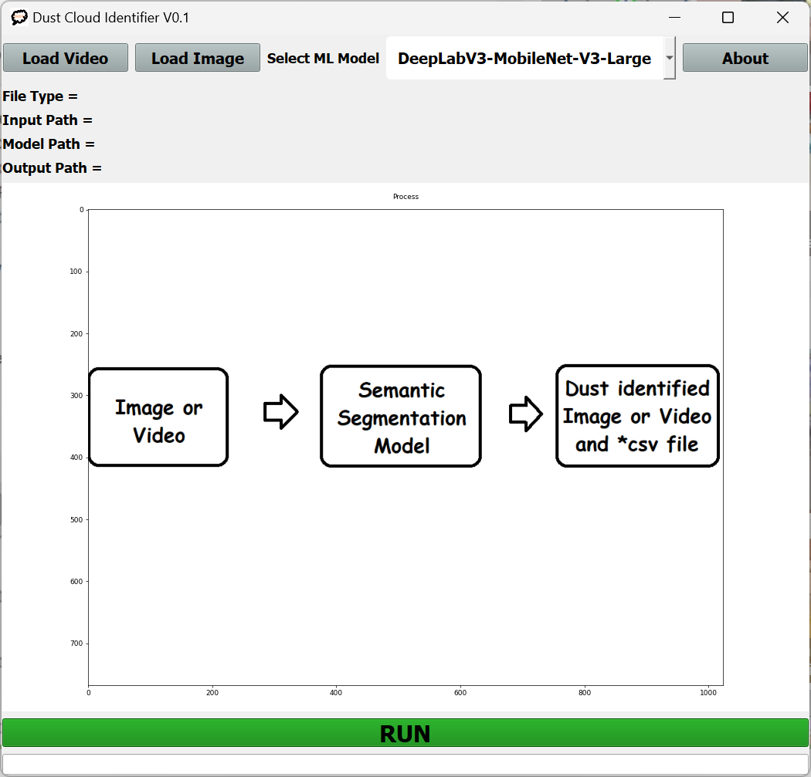
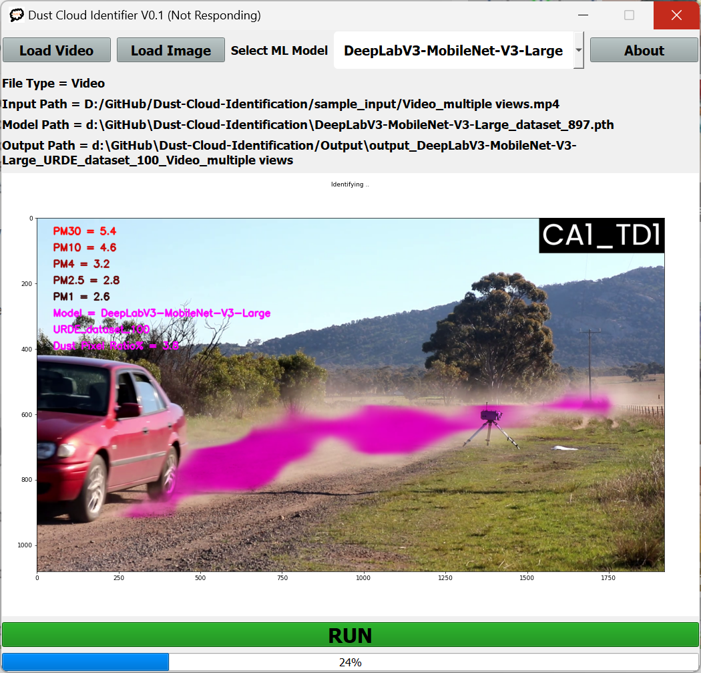

# Dust Cloud Identification GUI Widget
 Dust Cloud Identification Widget can be used to identify and approximately quantify dust clouds emitted by traffic.
 
## Windows executale can be downloaded from [This Link](https://drive.google.com/file/d/1GGVB_ZlTiSvwBBibxIPIDCeZ-qNZbKgj/view?usp=share_link)
Test Environment : Ryzen 9 5900HX, RAM 32GB, Nvidia RTX3080 Mobile 32GB

 
## Step 1 : Load Image or Video you want to segmentate dust


## Step 2 : Select the Machine Learning Model



## Step 3 : Run !!!

## How to create executable ?

1. Download and install [Python](https://www.python.org/downloads/)

2. Create python vitual environmnet (environment name = env),

**venv**
```
python -m venv env
```

3. Activate vitual environmnet,
Navigate to the '\env\Scripts\'

```
\env\Scripts\activate.bat
```

4. Navigate to 'Dust-Cloud-Identification' folder, and Install required packages from requirements.txt,

**requirements**
```
python.exe -m pip install --upgrade pip
```
```
pip install -r requirements.txt
```

5. Create executable using 'cxfreeze',
**cxfreeze**
```
cxfreeze -c main.py --icon=icon.ico --target-dir dist --packages=torch --target-name=Dust-Cloud-Identification --base-name Win32GUI
```

6. Copy 'app_data', 'output' folders and style.qss file into the 'dist' folder,

7. Download pre-trained ML models from 'model_download_links.txt' and paste them in 'dist' folder,

8. Run Dust-Cloud-Identification.exe

## How to run code from source files ?

1. Follow step 1 to 4 from above,

2. Navigate to Dust-Cloud-Identification' folder and run 'main.py',

**main.py**
```
python main.py
```

## Research Paper:
[Beyond Conventional Monitoring: A Semantic Segmentation Approach to Quantifying Traffic-Induced Dust on Unsealed Roads](https://www.mdpi.com/2637708)


